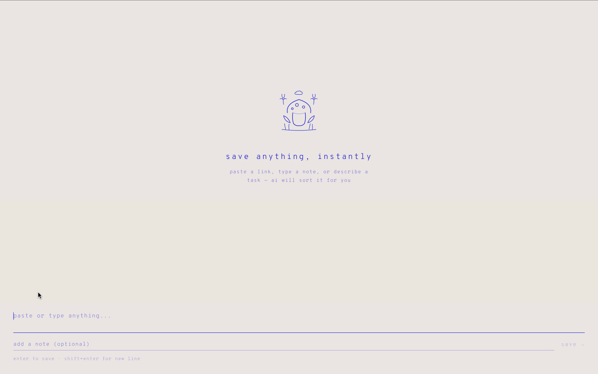
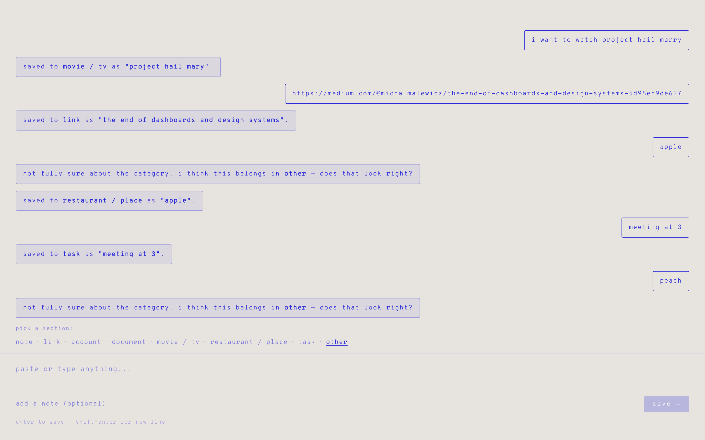

# oneplace

> everything you saved, one quiet place.

**live demo → [oneplace-cb648.web.app](https://oneplace-cb648.web.app/)**

---

## what is it

oneplace is a personal knowledge aggregator. paste anything — a link, a note, a password, a restaurant name, a movie title — and AI automatically categorizes it and places it on a visual board. ask for it back in plain language whenever you need it.

no folders. no tags. no manual sorting. just save and ask.

---

## screenshots





---

## features

- **ai categorization** — claude haiku reads what you paste and assigns it to the right section automatically
- **chat-style input** — feels like messaging an assistant, not filing a document
- **natural language retrieval** — ask "what restaurants did i save?" and get an instant answer
- **kanban board** — all saved items organized in collapsible columns
- **drag and drop** — move cards between sections by dragging
- **custom sections** — create your own categories beyond the 8 defaults
- **edit cards** — click any card to edit content, source, or section
- **duplicate detection** — saves the same content twice? the app catches it

---

## default sections

| key | label |
|-----|-------|
| `note` | note |
| `link` | link |
| `account` | account |
| `document` | document |
| `movie_tv` | movie / tv |
| `restaurant_place` | restaurant |
| `task` | task |
| `other` | other |

---

## tech stack

| layer | choice |
|-------|--------|
| frontend | react 18 + vite + typescript |
| database | firebase firestore |
| auth | firebase auth |
| ai | claude haiku (`claude-haiku-4-5`) |
| deployment | firebase hosting |

---

## run locally

```bash
# 1. clone
git clone https://github.com/FishShao/OnePlace.git
cd OnePlace

# 2. install
npm install

# 3. set environment variables
cp .env.local.example .env.local
# fill in your keys in .env.local

# 4. start dev server
npm run dev
```

open [localhost:5173](http://localhost:5173)

---

## environment variables

```
VITE_ANTHROPIC_API_KEY=
VITE_FIREBASE_API_KEY=
VITE_FIREBASE_AUTH_DOMAIN=
VITE_FIREBASE_PROJECT_ID=
VITE_FIREBASE_STORAGE_BUCKET=
VITE_FIREBASE_MESSAGING_SENDER_ID=
VITE_FIREBASE_APP_ID=
```

---

## project structure

```
src/
├── api/
│   └── claude.ts          # categorize() and retrieve()
├── components/
│   ├── ChatPanel.tsx       # chat input — save and query
│   ├── Board.tsx           # kanban board layout
│   ├── SectionColumn.tsx   # one column per section
│   ├── ItemCard.tsx        # individual saved item card
│   └── ItemDetail.tsx      # edit/view modal
├── hooks/
│   ├── useItems.ts         # firestore listener + item operations
│   └── useSections.ts      # custom sections
├── utils/
│   └── intentDetector.ts   # save vs. query heuristic
├── firebase.ts
├── App.tsx
└── main.tsx
```

---

## commands

```bash
npm run dev       # dev server at localhost:5173
npm run build     # production build
npm run preview   # preview production build
```
